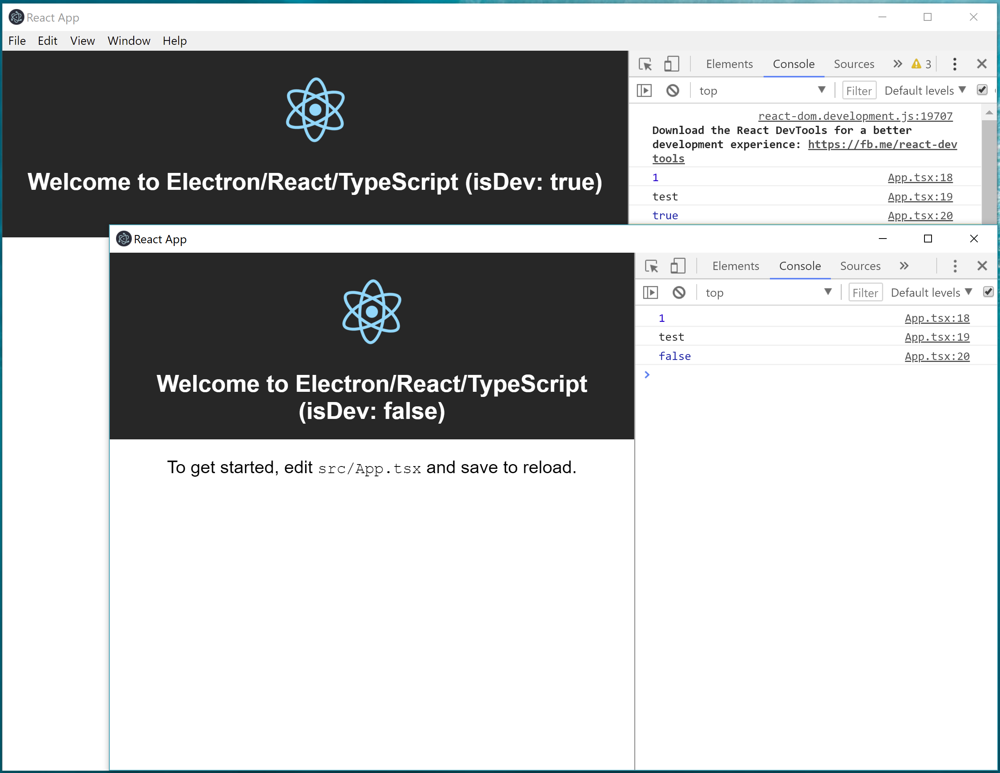

# Steps

1. Create a new [TypeScript React app](https://github.com/wmonk/create-react-app-typescript): 

    - `create-react-app electron-react-typescript --scripts-version=react-scripts-ts`

2. Add electron packages ([electronjs](https://electronjs.org/) & [electron builder](https://www.electron.build/)): 
    - `yarn add --dev electron`
    - `yarn add --dev electron-builder`
    - `yarn add electron-is-dev`
    - `yarn add --dev @types/electron-is-dev`

3. Add [src/electron/index.ts](./src/electron/index.ts) and [src/electron/tsconfig.json](./src/electron/tsconfig.json)

4. Update [package.json](./package.json)

5. To start local dev:
    - `yarn start`
    - `yarn electron-dev`

6. To package and ship the app:

    - `yarn electron-pack`

# References
- [How to build an Electron app using create-react-app. No webpack configuration or “ejecting” necessary.](https://medium.freecodecamp.org/building-an-electron-application-with-create-react-app-97945861647c)
- [From React to an Electron app ready for production](https://medium.com/@kitze/%EF%B8%8F-from-react-to-an-electron-app-ready-for-production-a0468ecb1da3)
- [electron/electron-quick-start-typescript](https://github.com/electron/electron-quick-start-typescript)
- [electron builder configuration](https://www.electron.build/configuration/configuration)
